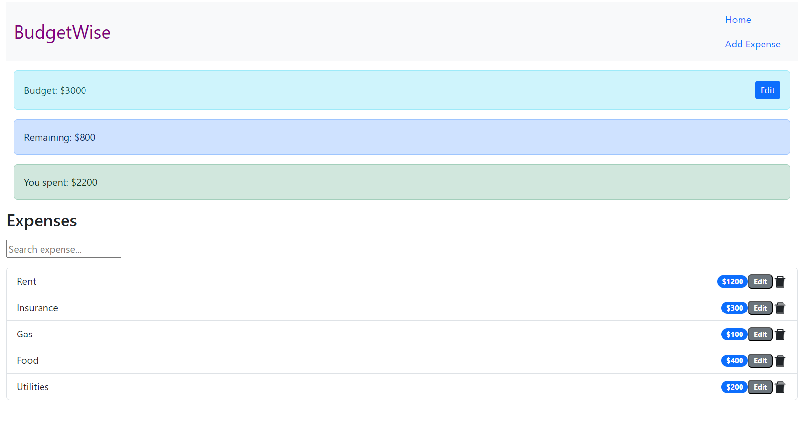

# BudgetWise

BudgetWise is a budget management application that helps you track your expenses and keep an eye on your remaining balance. It provides an intuitive interface to manage your budget, add expenses, and monitor your spending.

The project consists of two repositories:

1. [json-server repository](https://github.com/nnpk1007/budget-wise-backend): This repository contains the code for the JSON Server, which serves as the backend for BudgetWise. It handles the storage and retrieval of budget and expense data.
2. [React app repository](https://github.com/nnpk1007/react-project-budget-wise): This repository contains the code for the React frontend of BudgetWise. It provides the user interface for interacting with the budget and expense data.

## Custom Environment Variables
The React app uses custom environment variables to configure different settings based on the environment (development or production). The following files have been provided:

- env.development: Contains environment variables used for development.
- env.production: Contains environment variables used for production.

## Bootstrap
The BudgetWise app utilizes the Bootstrap CSS framework for styling and layout. Bootstrap is already included as a dependency in the React app.

To customize the styling, refer to the official Bootstrap documentation for guidance.

## Development
To work on BudgetWise locally, follow the steps below:

### Setting up the JSON Server
1. Clone the [json-server repository](https://github.com/nnpk1007/budget-wise-backend) to your local machine, and change directory into this folder
2. Install the required dependencies by running the following command : 
    <pre>
    npm install
    </pre>
3. Start the JSON Server by running the following command:
    <pre>
    json-server db.json
    </pre>
    This will start the JSON Server on the default port 3000

### Setting up the React App
1. Clone the [react-project-budget-wise](https://github.com/nnpk1007/react-project-budget-wise) repository to your local machine, and change directory into this folder
2. Install the required dependencies by running the following command in the repository's root directory:
    <pre>
    npm install
    </pre>
3. Start the React development server by running the following command:
    <pre>
    npm start
    </pre>
    This will start the React app in development mode and open it in your default browser. Any changes you make to the code will trigger an automatic reload.
4. You can access the BudgetWise application by visiting [http://localhost:4000](http://localhost:4000) in your browser.

## Production
- The BudgetWise app is already deployed and accessible using the following link: [https://flatiron-phase-2-project-budget-wise.netlify.app/](https://flatiron-phase-2-project-budget-wise.netlify.app/)
- The json database is already deployed and accessible using the following link: [https://budget-wise-backend.onrender.com/](https://budget-wise-backend.onrender.com/)

### To use the deployed version, simply visit the provided [link](https://flatiron-phase-2-project-budget-wise.netlify.app/) in your browser.

## Features
- View budget, remaining balance, total spent, and list of expenses.
- Edit the budget amount.
- Add new expenses, including the title and cost.
- Edit or delete existing expenses.
- Real-time updates and calculations based on the budget and expenses.

## Technologies Used
- JSON Server: A simple JSON-based database to store budget and expense data.
- React: A JavaScript library for building user interfaces.
- Render: A hosting platform for deploying database (back-end)
- Netlify: A hosting platform for deploying React applications (front-end).
- Bootstrap: A CSS framework for styling and layout.

Feel free to contribute to the project by submitting pull requests or opening issues in the respective repositories.